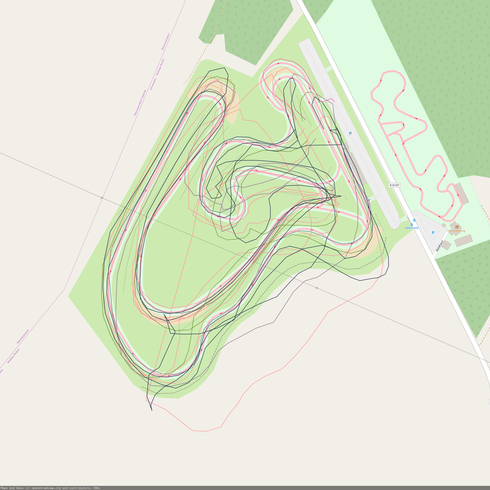
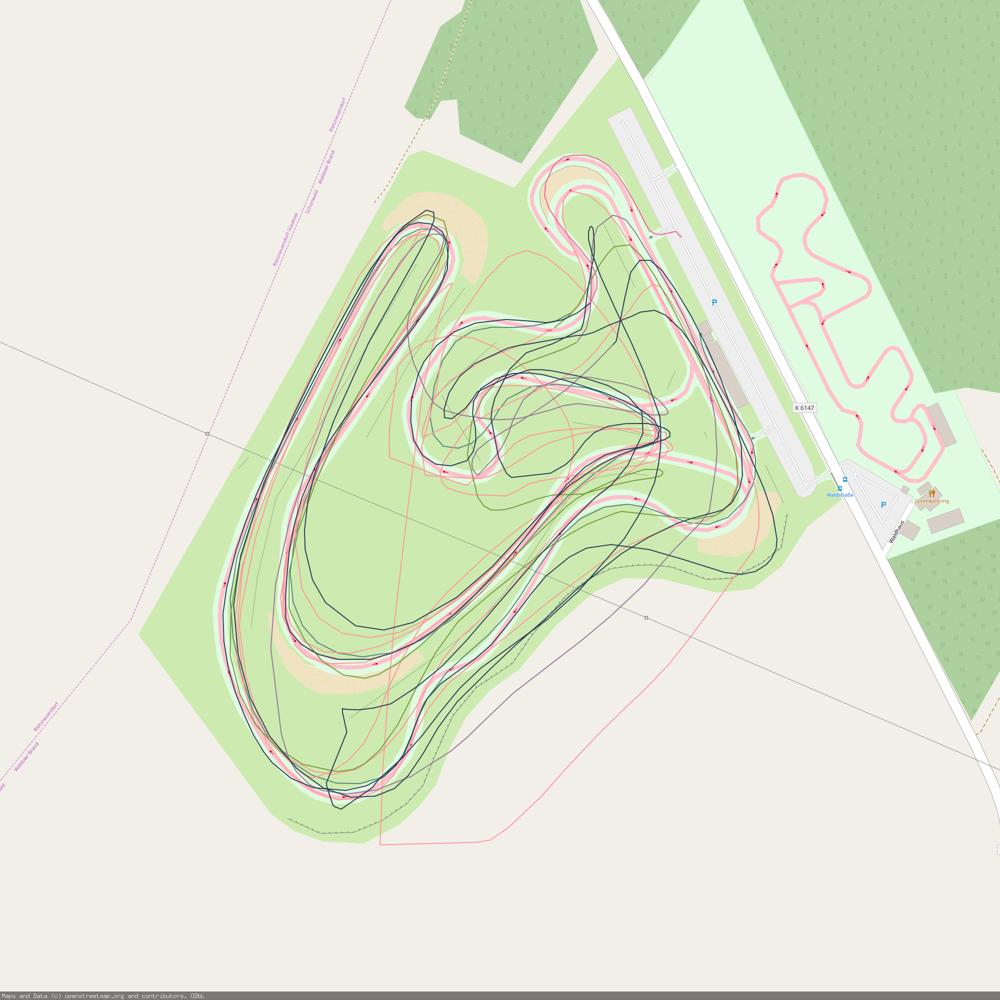
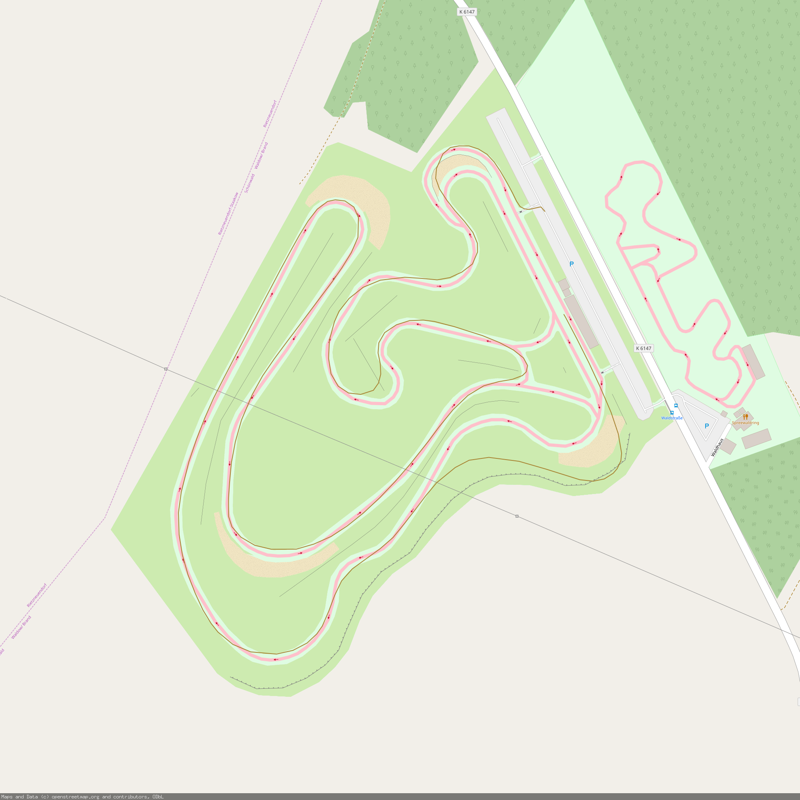

[](https://travis-ci.org/thomasjungblut/trackaddict-cli)
# TrackAddict CLI

The TrackAddict Command Line Interface (CLI) will help to slice and dice the raw csv output from the TrackAddict app. 
Currently it has functionality to smooth GPS data, recalculate laps and plot them on an OpenStreet map.

We built this tool to fix bad GPS resolution/reception from Android phones and to still create some reliable lap times out of noisy measurements.   

Disclaimer: This project is not affiliated with the TrackAddict product.

## Installation

With golang 1.12 (or higher) installed, just run

> go install github.com/thomasjungblut/trackaddict-cli

Make sure your PATH includes the $GOPATH/bin directory so your commands can be easily used:

> export PATH=$PATH:$GOPATH/bin

## Examples

Printing the Laps that TrackAddict has created can be done via:

> trackaddict-cli laps -i example/STC_log.csv

That should give an output like this:

```
+------------+-----------+---------------+
| LAP NUMBER | TIME (S)  | MEASURE RANGE |
+------------+-----------+---------------+
| 1 (Outlap) | 2m35.214s | 0-3154        |
|          2 | 7m23.887s | 3155-12133    |
|          3 | 1m47.963s | 12134-14317   |
|          4 | 1m55.877s | 14318-16665   |
|          5 | 5m57.949s | 16666-23896   |
| 6 (Inlap)  | 1m4.231s  | 23897-25196   |
+------------+-----------+---------------+
```

As you can see here, some laps seem to get mixed together by noisy GPS measures, let's plot them to visualize:

> trackaddict-cli plot -i example/STC_log.csv -o docs/raw_output.png



That's pretty noisy! Let's smooth the data bit. We're using the accelerometer data to improve the GPS using a Kalman Filter by running:

> trackaddict-cli plot -i example/STC_log.csv -o docs/filtered_output.png --smooth



As you can see, especially the bits where the accelerometer has strong evidence (eg after the long straight and before the hairpin turn on the top left), the GPS signal became much more accurate. 

The same works for the lap times. Let's smooth the GPS data again and recalculate the laps based on that:

> trackaddict-cli laps -i example/STC_log.csv --smooth --fix-laps

We can plot laps individually:

> trackaddict-cli plot -i example/STC_log.csv -o docs/lap_plot --smooth --fix-laps --plot-each-lap

smooth and fix flags are optional, so you can also plot the track addict data directly if your data does not need any filtering:

> trackaddict-cli plot -i example/STC_log.csv -o docs/lap_plot --plot-each-lap

That gives us the ability to just take a look at our inlap at the end:

